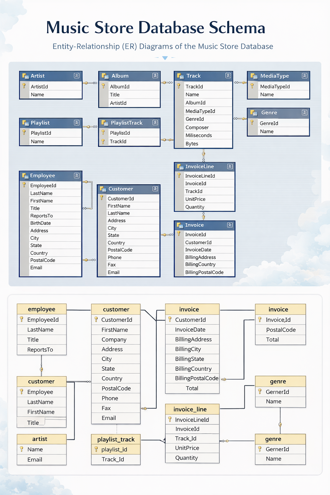

# 🎵 Music Store Data Analysis (SQL Project)

## 📌 Project Overview

This project performs **data analysis on a digital music store database (Chinook)** using **PostgreSQL**.
The goal is to extract meaningful **business insights** about customers, sales performance, music genres, and artist popularity using advanced SQL queries.

The analysis includes **joins, aggregations, subqueries, Common Table Expressions (CTEs), and window functions** to explore patterns in the data.

---

## 🗄️ Database Schema

The Chinook database simulates a digital music store and contains information about:

* Artists
* Albums
* Tracks
* Genres
* Customers
* Employees
* Invoices
* Invoice Line Items
* Playlists
* Media Types

### 📊 ER Diagram



---

## 📂 Database Tables

| Table              | Description                     |
| ------------------ | ------------------------------- |
| **Artist**         | Contains artist information     |
| **Album**          | Albums released by artists      |
| **Track**          | Individual music tracks         |
| **Genre**          | Music genres (Rock, Jazz, etc.) |
| **Media_Type**     | Format of the music file        |
| **Playlist**       | Music playlists                 |
| **Playlist_Track** | Tracks included in playlists    |
| **Employee**       | Store employees                 |
| **Customer**       | Music store customers           |
| **Invoice**        | Customer purchase invoices      |
| **Invoice_Line**   | Tracks purchased per invoice    |

---

## 🔍 Business Questions Answered

### Easy Level

1. Who is the **senior most employee** based on job title?
2. Which **countries have the most invoices**?
3. What are the **top 3 invoice totals**?
4. Which **city generates the highest revenue**?
5. Who is the **best customer**?

### Moderate Level

6. Who are the **Rock music listeners**?
7. Which **artists have written the most rock songs**?
8. Which **tracks are longer than the average song length**?

### Advanced Level

9. How much has each **customer spent on the best-selling artist**?
10. What is the **most popular genre for each country**?
11. Who is the **top customer in each country**?

---

## 🛠️ Tools & Technologies

* **PostgreSQL**
* **SQL**
* **pgAdmin**
* **GitHub**

---

## 📊 SQL Concepts Used

* SELECT statements
* Joins (INNER JOIN)
* Aggregation functions
* GROUP BY
* ORDER BY
* Subqueries
* Common Table Expressions (CTE)
* Window Functions
* Data filtering

---

## 📈 Key Insights

* Certain **countries generate significantly more revenue** than others.
* **Rock music** is one of the most popular genres among customers.
* A small number of **top customers contribute a large portion of revenue**.
* Some **artists dominate the music store catalog**.

---

## 📁 Project Structure

```
Music-Store-Data-Analysis-SQL
│
├── dataset
│   ├── artist.csv
│   ├── album.csv
│   ├── customer.csv
│   ├── invoice.csv
│   └── track.csv
│
├── sql
│   └── music_store_analysis.sql
│
├── schema
│   └── music_store_schema_combined.png
│
└── README.md
```

---

## 🚀 How to Run the Project

1. Create the database

```sql
CREATE DATABASE music_store_data_analysis;
```

2. Run the table creation script

3. Import the CSV dataset into PostgreSQL

4. Execute the SQL analysis queries

---

## 👤 Author

**Chandan Kumar Sah**

Aspiring **Data Analyst / Data Scientist** passionate about extracting insights from data using SQL, Python, and machine learning.

---

⭐ If you like this project, consider giving it a **star** on GitHub!
